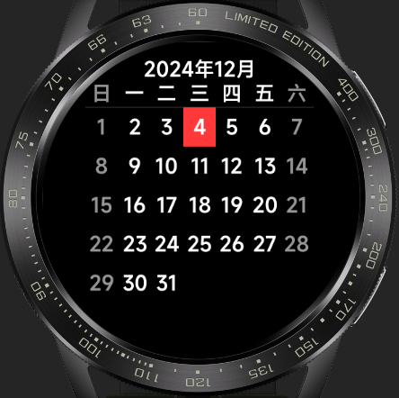
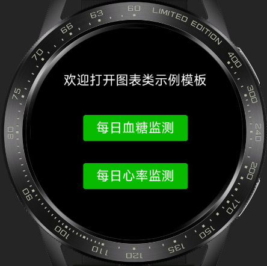
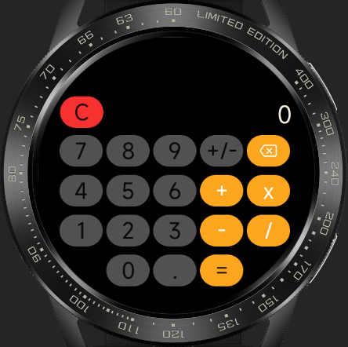
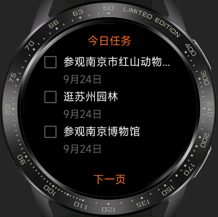
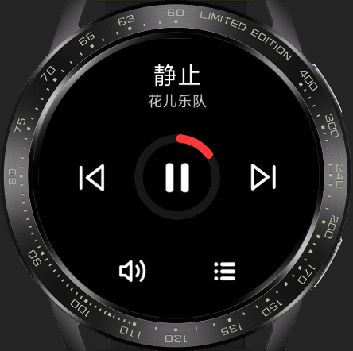
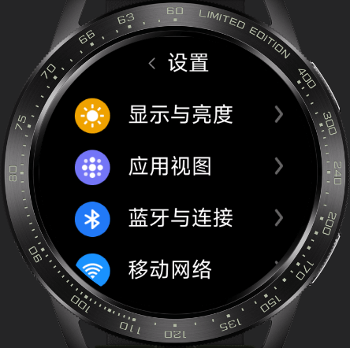
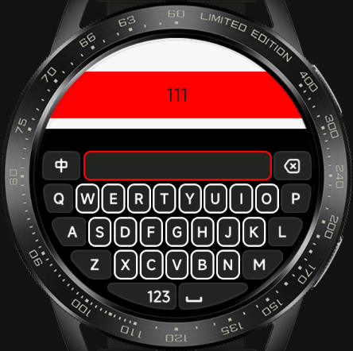
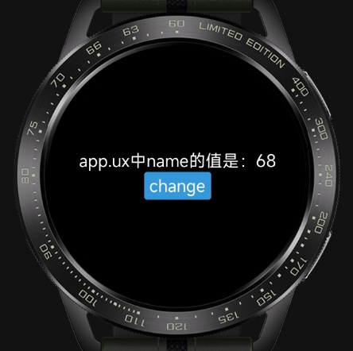
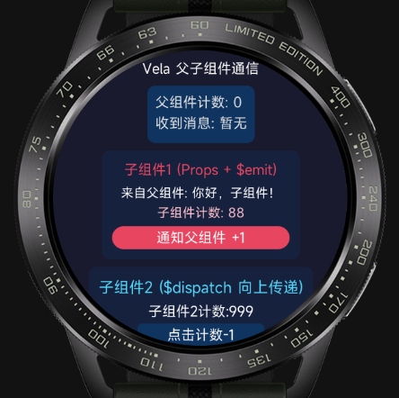
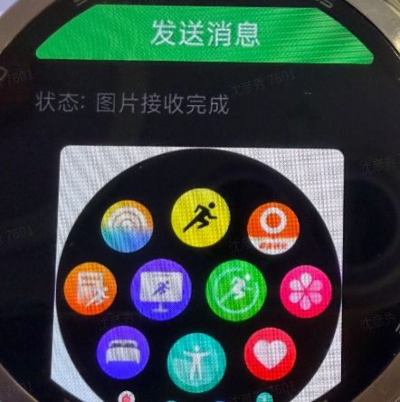

<!-- 源地址: https://iot.mi.com/vela/quickapp/en/samples/ -->
<!-- 最近更新日期: 2026-05-29 -->

Calendar The calendar app is a tool that facilitates users in recording, scheduling, and tracking important events and activities. This app has been adapted for multiple screens, allowing users to view dates for the current year and access more detailed information by clicking on specific dates. With a simple page design and user-friendly operation, developers can quickly get started and create a more feature-rich calendar app based on this application.

 

Chart The chart quick app is a data visualization tool that can quickly and easily generate various types of charts based on data, including line charts, bar charts, and other common chart types. This app has been adapted for multiple screens, is simple and easy to use, and is suitable for various data analysis and presentation scenarios.

 

Calculator UI The calculator quick app UI has been adapted for square, round, and racetrack screens, displaying different UI styles based on the screen type. It is a powerful and easy-to-use calculator application. Based on this example, developers can create an application capable of performing various mathematical operations, including basic addition, subtraction, multiplication, division, and percentage calculations.

 

To-Do List The to-do list quick app is a simple and easy-to-use task management tool that helps you efficiently record and manage daily tasks and to-do items. This app has been adapted for square, round, and racetrack screens, with a simple page design and user-friendly operation. Developers can quickly get started and create a more feature-rich task management tool based on this application.

 

Player This is an efficient and easy-to-use player quick app. The app features a simple and user-friendly interface and has been adapted for multiple screens, including round and square screens. Its functions include song playback and pause, switching between tracks, and displaying the playlist. The player page is designed to be user-friendly with simple interactions, allowing developers to quickly get started and create a more feature-rich player quick app based on this example.

 

Settings UI This is a settings app UI that supports multi-screen adaptation. Based on this development, users can easily access and modify various settings, including network settings, volume, Bluetooth, Wi-Fi, screen brightness, notifications, and more. The app features a simple and user-friendly interface, allowing users to easily find the settings options they need.

 

Input Method The input method app is a highly practical tool that helps users quickly and accurately input text on smartwatches and bracelets, improving work and study efficiency. This input method component has been adapted for multiple screens, including round and square screens, and supports switching between Chinese and English. By introducing this component, text input on smartwatches and bracelets can be easily achieved.

Publish-Subscribe This demo is based on the classic Publish-Subscribe (Pub/Sub) design pattern, providing a lightweight and flexible cross-module communication solution that enables message passing without direct dependencies between modules. Its core functions include event subscription ($on), message publishing ($emit), subscription cancellation ($off), and event existence judgment ($judge), supporting asynchronous communication needs in various scenarios. Whether it's collaboration between front-end components or联动 between plugin modules, efficient message passing can be achieved through simple calls, helping to simplify code dependencies and improve project maintainability. The code can be directly integrated into Vela quick app projects and serves as a practical reference for learning design patterns and solving cross-module communication problems.

 

Parent-Child Component Communication This example focuses on the parent-child component communication scenario in Vela quick apps, implementing three core functions: ① The parent component passes data to the child component through props, adhering to the principle of unidirectional data flow; ② The child component triggers custom events through $emit, which the parent component listens for and receives parameters from; ③ The child component implements event bubbling upward through $dispatch. The example code has a clear structure and can be run directly, helping developers quickly grasp the communication logic and best practices for parent-child components in Vela quick apps.

 

Cross-Device Image Transfer This example focuses on the cross-device interconnection communication scenario in Vela quick apps, implementing image transfer functionality between a smartwatch and an Android phone based on the system.interconnect API. It achieves three core functions: ① Establishing a bidirectional communication channel between the smartwatch and the phone through interconnect, supporting real-time monitoring of connection status (onopen/onclose/onerror); ② The smartwatch actively sends an image request, and the phone responds by transmitting the image in Base64 fragments (using a three-stage protocol: header→data→end); ③ The smartwatch receives and assembles the fragments into a complete image, writes it to local cache using the system.file API, and renders it for display, showing the transfer progress throughout. The example code covers the complete链路 (chain) of connection management, fragment protocol parsing, ArrayBuffer conversion, and file storage, and can be run directly, helping developers quickly grasp the communication architecture and engineering practices for cross-device data transfer in Vela quick apps.

 
