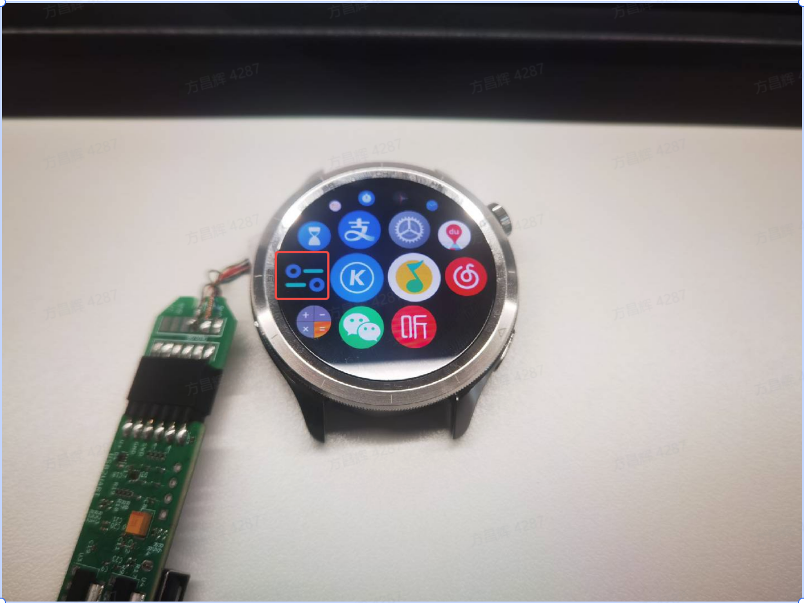
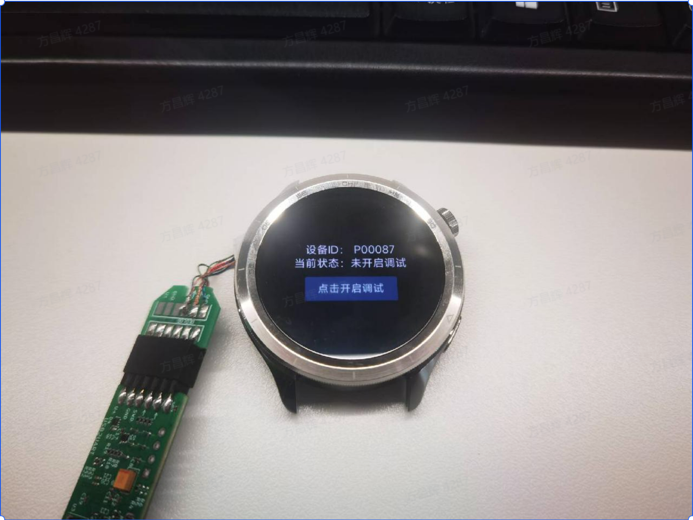
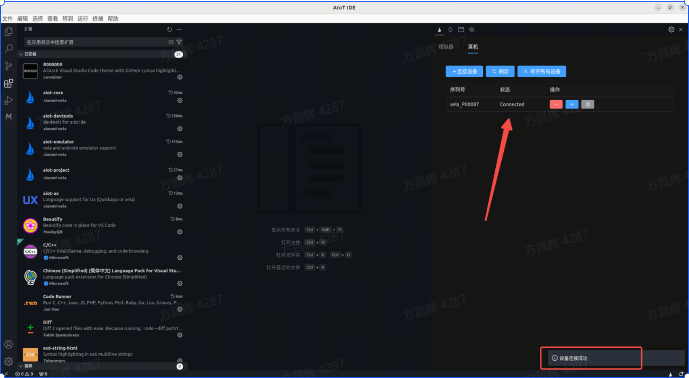
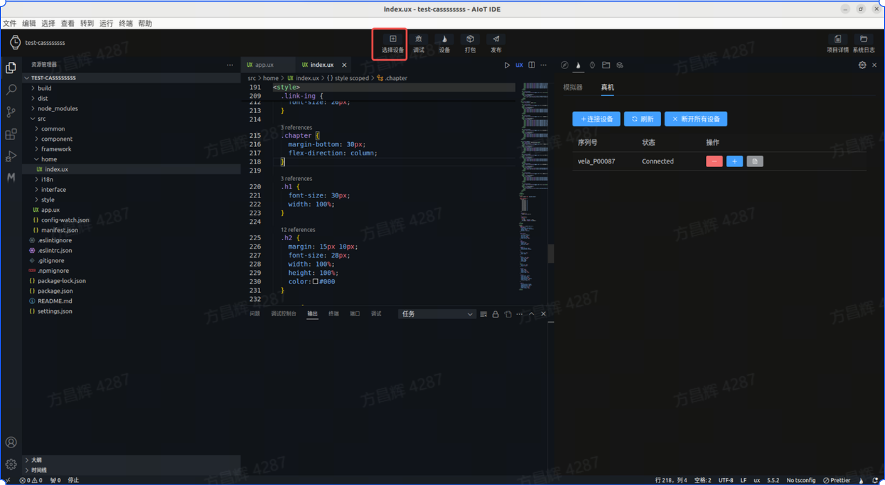
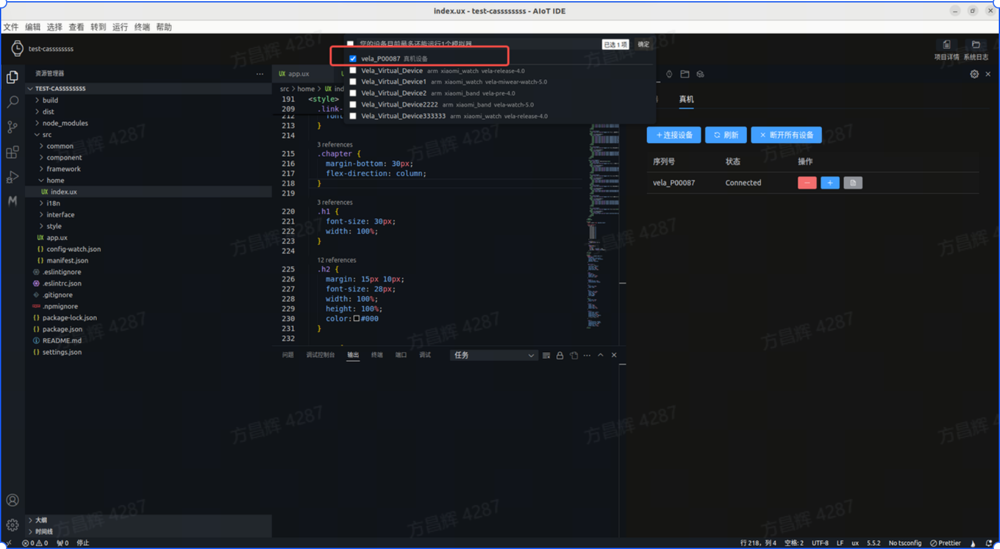
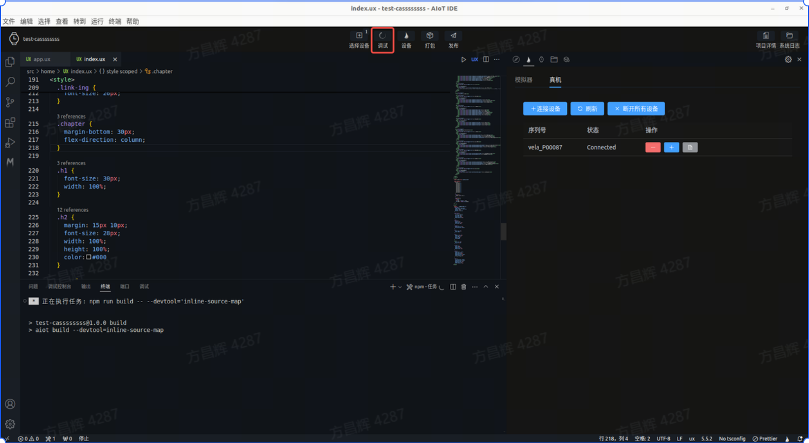
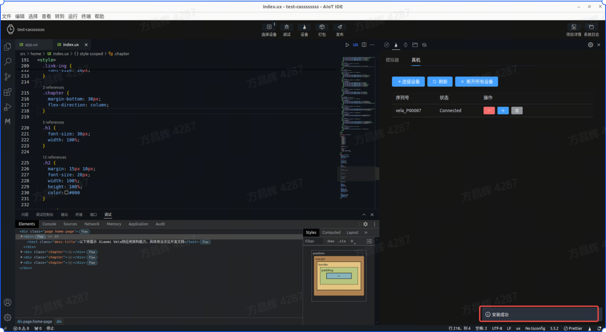
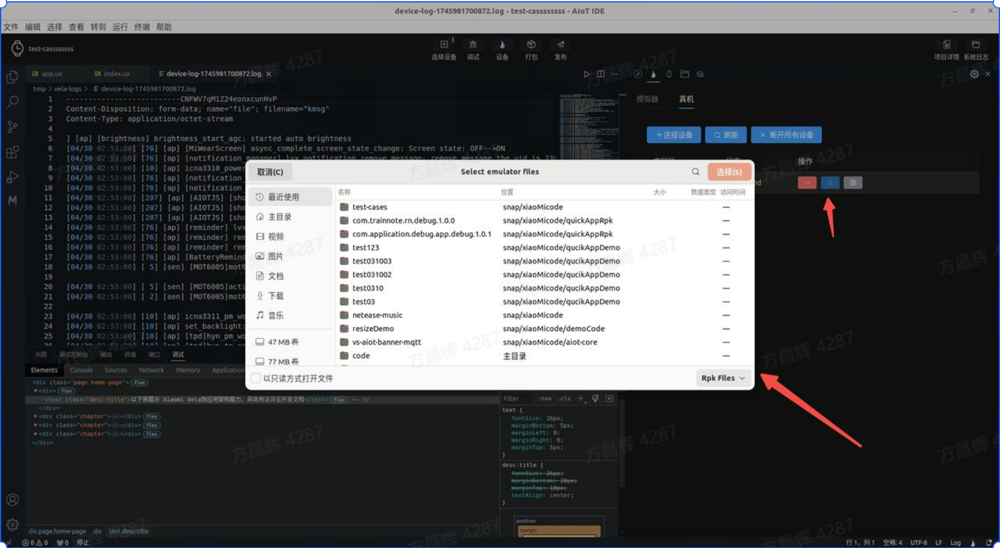
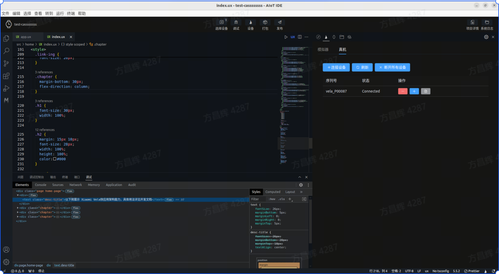
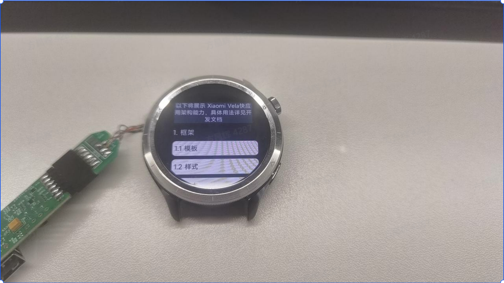

<!-- 源地址: https://iot.mi.com/vela/quickapp/en/tools/devicedebug/start.html -->

# Function Introduction

It supports real-device debugging when developing **Xiaomi Vela JS** applications. In `AIoT-IDE`, you can connect to a real device using its device ID and push the application to the real device for debugging.

## Device Upgrade

Currently, real-device debugging is only supported on `Xiaomi Watch S4` devices. Please contact Xiaomi staff to obtain the document `Xiaomi Vela Device Real-Device Debugging Full Process Guide`. Follow the document to obtain the corresponding OTA package and upgrade the device to the specified version that supports real-device debugging. Note: Upgrading firmware carries certain risks, and real-device debugging is currently only open to specific partners.

## Environment Preparation

  1. Use the beta version of Xiaomi Wear and connect the test device.
  2. Ensure that the computer network and the mobile phone network are on the same local area network.

## Connection

  1. Open rpk First, open the installed real-device debugging debug-app on the real device (marked by the red box in the image).

  2. Establish connection After opening the debug-app, click to enable debugging. The middle button status of the debug-app will change to [Waiting for IDE Connection]. 

  3. Connect from IDE Open AIoT-IDE on the computer and enter the real-device debugging interface. 

  4. Start connection Click Connect Device, enter the device ID (obtained from the debug-app above), and click Connect.

  5. Connection successful After a successful connection, a real device entry will appear in the list below the button, with the status displayed as Connected.

## Debugging

After successfully connecting to the real device, you can proceed to the debugging phase and debug the currently developed Vela application on the real device.

  1. Select device Click Connect Device in the top tab bar, select the real device, and then click Debug to enter real-device debugging mode.

  2. Enter real-device debugging After successful debugging and running, the current application will automatically open on the real device, and the debugging panel will open directly at the bottom of AIoT-IDE.

  3. Obtain logs Click Obtain Logs in the real-device debugging panel to directly pull logs from the real device. The number of logs obtained depends on the size of the device's kernel log buffer.

  4. Push other rpk On the real-device debugging page, click the Push rpk button to select and push an rpk from a non-current project for real-device debugging.

  5. Real-device debugging effect Debug on the AIoT-IDE debugging panel, and the real device will display the debugging effect in real-time (but hot updates are not supported. If you need to modify the source code, click the Package button to package the current application and install the rpk through step 4).

 
