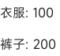

<!-- 源地址: https://iot.mi.com/vela/quickapp/zh/components/container/list-item.html -->

# list-item

## 概述

[`<list>`](</vela/quickapp/zh/components/container/list.html>)的子组件，用来展示列表具体 item，宽度默认充满 list 组件。

## 子组件

支持

## 属性

支持[通用属性](</vela/quickapp/zh/components/general/properties.html>)

名称 | 类型 | 默认值 | 必填 | 描述
---|---|---|---|---
type | `<string>` | - | 是 | list-item 类型，值为自定义的字符串，如'loadMore'。相同的 type 的 list-item 必须具备完全一致的 DOM 结构。因此，在 list-item 内部需谨慎使用 if 和 for，因为 if 和 for 可能造成相同的 type 的 list-item 的 DOM 结构不一致，从而引发错误 

## 样式

支持[通用样式](</vela/quickapp/zh/components/general/style.html>)

为了达到组件复用、优化性能的目的，请显示指定宽度和高度。

## 事件

支持[通用事件](</vela/quickapp/zh/components/general/events.html>)

## 示例代码

```html
<template>
  <div class="page">
    <list class="list">
      <list-item for="{{productList}}" class="item" type="list-item">
        <text>{{$item.name}}: {{$item.price}}</text>
      </list-item>
    </list>
  </div>
</template>

<script>
  export default {
    data: {
      productList: [
        { name: '衣服', price: '100' },
        { name: '裤子', price: '200' }
      ],
    }
  }
</script>

<style>
  .page {
    padding: 30px;
    background-color: white;
  }

  .list {
    width: 100%;
    height: 100%;
  }

  .item {
    height: 40px;
  }
</style>
```

### 效果展示


