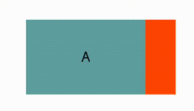
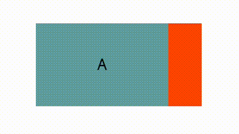

<!-- 源地址: https://iot.mi.com/vela/quickapp/zh/components/container/scroll.html -->

# scroll2+

## 概述

滚动视图容器。竖向或水平方向滚动容器，竖向滚动需要设置定高，水平滚动需要设置定宽。

## 子组件

支持。也支持嵌套子 scroll。

## 属性

支持[通用属性](</vela/quickapp/zh/components/general/properties.html>)

名称 | 类型 | 默认值 | 必填 | 描述
---|---|---|---|---
scroll-x | `<boolean>` | false | 否 | 是否允许横向滚动
scroll-y | `<boolean>` | false | 否 | 是否允许纵向滚动
scroll-top | `<number>` \| `<string>` | - | 否 | 设置竖向滚动条位置，内容顶部到 scroll 顶部的距离，如果有滚动吸附效果则先滚动再吸附
scroll-bottom | `<number>` \| `<string>` | - | 否 | 设置竖向滚动条位置，内容底部到 scroll 底部的距离，如果有滚动吸附效果则先滚动再吸附。同时设置 scroll-top 和scroll-bottom 以scroll-top为准
scroll-left | `<number>` \| `<string>` | - | 否 | 设置横向滚动条位置，内容左侧到 scroll 左侧的距离，如果有滚动吸附效果则先滚动再吸附
scroll-right | `<number>` \| `<string>` | - | 否 | 设设置横向滚动条位置，内容右侧到 scroll 右侧的距离，如果有滚动吸附效果则先滚动再吸附。同时设置 scroll-left 和scroll-right 以scroll-left为准
bounces | `<boolean>` | false | 否 | 是否边界回弹 

## 样式

支持[通用样式](</vela/quickapp/zh/components/general/style.html>)

名称 | 类型 | 默认值 | 描述
---|---|---|---
scroll-snap-type[3+](https://iot.mi.com/vela/quickapp/zh/guide/version/APILevel3) | - | none | 与scroll-snap-align配合使用，作用在scroll组件上，表示scroll的滚动吸附类型。第一个参数为x或y，表示水平方向上滚动或竖直方向上滚动；第二个参数为 mandatory、proximity、 cross。mandatory：表示选择距离最近的锚点吸附；proximity：表示距离吸附锚点不到容器高度的 30% 时才会吸附；cross：表示子组件能够被吸附的边界出现在 scroll 视口内才会吸附。默认为 proximity<br>aiot-toolkit最低版本：1.1.4
scroll-snap-align[3+](https://iot.mi.com/vela/quickapp/zh/guide/version/APILevel3) | none \| start \| center \| end \| edge | none | 与scroll-snap-type配合使用，作用在scroll子组件上，表示子组件和scroll的对⻬形式。none：表示无需对⻬，默认值；start：表示组件和scroll起始边对⻬；center：表示组件和scroll中心对⻬；end：表示组件和scroll终止边对⻬；edge：在滚动方向上，组件和 scroll 起始边或者结束边对齐<br>aiot-toolkit最低版本：1.1.4
scroll-snap-stop[3+](https://iot.mi.com/vela/quickapp/zh/guide/version/APILevel3) | normal \| always | normal | 值为 always 时不能跨越元素进行吸附<br>aiot-toolkit最低版本：1.1.4 

### 示例代码

  * scroll-snap-type & scroll-snap-align

```html
<template>
  <div class="page">
    <div class="scroll-container">
      <scroll class="box" scroll-x="true" style="scroll-snap-type: x proximity;">
        <text class="scroll-item color-1">A</text>
        <text class="scroll-item color-2">B</text>
        <text class="scroll-item color-1" style="scroll-snap-align: start;">C</text>
        <text class="scroll-item color-2">D</text>
        <text class="scroll-item color-1" style="scroll-snap-align: center;">E</text>
        <text class="scroll-item color-2">F</text>
        <text class="scroll-item color-1" style="scroll-snap-align: end;">G</text>
        <text class="scroll-item color-2">H</text>
      </scroll>
    </div>
  </div>
</template>

<script>
  export default {}
</script>

<style>
  .page {
    padding: 60px;
    flex-direction: column;
  }

  .scroll-container {
    width: 100%;
  }

  .box {
    margin-bottom: 30px;
    height: 100px;
    width: 200px;
  }

  .scroll-item {
    width: 80%;
    height: 100px;
    text-align: center;
  }

  .color-1 {
    background-color: cadetblue;
  }

  .color-2 {
    background-color: orangered;
  }
</style>
```



  * scroll-snap-stop

```html
<template>
  <div class="page">
    <div class="scroll-container">
      <scroll class="box" scroll-x="true" style="scroll-snap-type: x cross;scroll-snap-stop:always;">
        <text class="scroll-item color-1">A</text>
        <text class="scroll-item color-2" style="scroll-snap-align: center;">B</text>
        <text class="scroll-item color-1" style="scroll-snap-align: center;">C</text>
        <text class="scroll-item color-2" style="scroll-snap-align: center;">D</text>
        <text class="scroll-item color-1" style="scroll-snap-align: center;">E</text>
        <text class="scroll-item color-2" style="scroll-snap-align: center;">F</text>
        <text class="scroll-item color-1">G</text>
      </scroll>
    </div>
  </div>
</template>

<script>
  export default {}
</script>

<style>
  .page {
    padding: 60px;
    flex-direction: column;
  }

  .scroll-container {
    width: 100%;
  }

  .box {
    margin-bottom: 30px;
    height: 100px;
    width: 200px;
  }

  .scroll-item {
    width: 80%;
    height: 100px;
    text-align: center;
  }

  .color-1 {
    background-color: cadetblue;
  }

  .color-2 {
    background-color: orangered;
  }
</style>
```



## 事件

名称 | 参数 | 描述
---|---|---
scrolltop | - | 滚动到顶部触发
scrollbottom | - | 滚动到底部触发
scroll | { scrollX, scrollY } | 滚动触发，scrollX 表示滚动的水平距离；scrollY 表示滚动的垂直距离 

## 方法

名称 | 参数 | 返回值 | 描述
---|---|---|---
getScrollRect | 无 | `<object>` | 获取滚动内容的尺寸
scrollTo | Object | 无 | 让滚动组件窗口滚动到某个坐标位置
scrollBy | Object | 无 | 使滚动组件窗口滚动一定距离 

### scrollTo方法Object参数

名称 | 类型 | 默认值 | 必填 | 描述
---|---|---|---|---
left | number | - | 否 | 滚动组件的横轴坐标值，不传表示横轴不滚动，负数按0处理，超出滚动范围按滚动边界处理
top | number | - | 否 | 滚动组件的纵轴坐标值，不传表示纵轴不滚动，负数按0处理，超出滚动范围按滚动边界处理
behavior | smooth / instant / auto | auto | 否 | 滚动行为，smooth-平滑滚动，instant-瞬间滚动，auto-等同于instant 

### scrollBy方法Object参数

名称 | 类型 | 默认值 | 必填 | 描述
---|---|---|---|---
left | number | - | 否 | 滚动组件的横轴偏移量，可以是负数，超出滚动范围按滚动边界处理
top | number | - | 否 | 滚动组件的纵轴偏移量，可以是负数，超出滚动范围按滚动边界处理
behavior | smooth / instant / auto | auto | 否 | 滚动行为，smooth-平滑滚动，instant-瞬间滚动，auto-等同于instant 

### 返回值（异步）

属性 | 类型 | 描述
---|---|---
width | `<number>` | 滚动内容的宽度，包含border和padding
height | `<number>` | 滚动内容的高度，包含border和padding 

## 示例代码

```html
<template>
  <div class="page">
      <scroll id="scrollId" scroll-y="true" onscrolltop="handleScrollTop">
          <div class="item">
             <text>北京</text>
          </div>
          <div class="item">
             <text>上海</text>
          </div>
          <div class="item">
             <text>广州</text>
          </div>
          <div class="item">
             <text>深圳</text>
          </div>
       </scroll>
  </div>
</template>

<script>
  export default {
    onShow() {
      this.$element('scrollId').getScrollRect({
        success({ width, height }) {
          console.log('宽度', width);
          console.log('高度', height);  
        }
      })

      // this.scrollTo()
      // this.scrollBy()
    },
    handleScrollTop() {
      console.info('scrolled top.')
    },
    scrollTo() {
      this.$element('scrollId').scrollTo({
        top: 1000,
        left: 0,
        behavior: 'smooth'
      })
    },
    scrollBy() {
      this.$element('scrollId').scrollBy({
        top: 1000,
        left: 0,
        behavior: 'smooth'
      })
    }
  }
</script>
<style>
  .page {
    justify-content: center;
    align-items: center;
  }

  #scrollId {
    width: 50%;
    height: 100px;
    flex-direction: column;
    background-color: yellowgreen;
  }

  .item {
    width: 100%;
    height: 50px;
    justify-content: center;
  }
</style>
```
