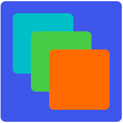

<!-- 源地址: https://iot.mi.com/vela/quickapp/zh/components/container/stack.html -->

# stack

## 概述

基本容器，子组件排列方式为层叠排列，每个直接子组件按照先后顺序依次堆叠，覆盖前一个子组件。

## 子组件

支持

## 属性

支持[通用属性](</vela/quickapp/zh/components/general/properties.html>)

## 样式

支持[通用样式](</vela/quickapp/zh/components/general/style.html>)

## 事件

支持[通用事件](</vela/quickapp/zh/components/general/events.html>)

## 示例代码

```html
<template>
  <div class="page">
    <stack class="stack">
      <div class="box box1"></div>
      <div class="box box2"></div>
      <div class="box box3"></div>
      <div class="box box4"></div>
    </stack>
  </div>
</template>

<style>
  .page {
    padding: 30px;
    background-color: white;
  }

  .box {
    border-radius: 8px;
    width: 100px;
    height: 100px;
  }

  .box1 {
    width: 200px;
    height: 200px;
    background-color: #3f56ea;
  }

  .box2 {
    left: 20px;
    top: 20px;
    background-color: #00bfc9;
  }

  .box3 {
    left: 50px;
    top: 50px;
    background-color: #47cc47;
  }

  .box4 {
    left: 80px;
    top: 80px;
    background-color: #FF6A00;
  }
</style>
```


