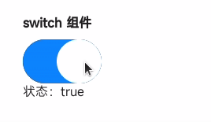

<!-- 源地址: https://iot.mi.com/vela/quickapp/zh/components/form/switch.html -->

# switch

## 概述

开关选择

## 子组件

不支持

## 属性

支持[通用属性](</vela/quickapp/zh/components/general/properties.html>)

名称 | 类型 | 默认值 | 必填 | 描述
---|---|---|---|---
checked | `<boolean>` | false | 否 | 可触发 checked 伪类（checked 伪类样式还未支持） 

## 样式

支持[通用样式](</vela/quickapp/zh/components/general/style.html>)

名称 | 类型 | 默认值 | 必填 | 描述
---|---|---|---|---
thumb-color | `<color>` | #ffffff 或者 rgb(255, 255, 255) | 否 | 滑块颜色
track-color | `<color>` | #0d84ff 或者 rgb(13, 132, 255) | 否 | 滑轨颜色 

## 事件

支持[通用事件](</vela/quickapp/zh/components/general/events.html>)

名称 | 参数 | 描述
---|---|---
change | {checked:checkedValue} | checked 状态改变时触发 

## 示例代码

```html
<template>
  <div class="page">
    <text class="title">switch 组件</text>
    <switch checked="{{ switchValue }}" class="switch" @change="onSwitchChange"></switch>
    <text>状态：{{ switchValue }}</text>
  </div>
</template>

<script>
  export default {
    private: {
      switchValue: true
    },
    onSwitchChange(e) {
      this.switchValue = e.checked
    }
  }
</script>

<style>
  .page {
    flex-direction: column;
    padding: 30px;
    background-color: #ffffff;
  }

  .title {
    font-weight: bold;
  }

  .switch {
    width: 100px;
    margin-top: 10px;
  }
</style>
```


