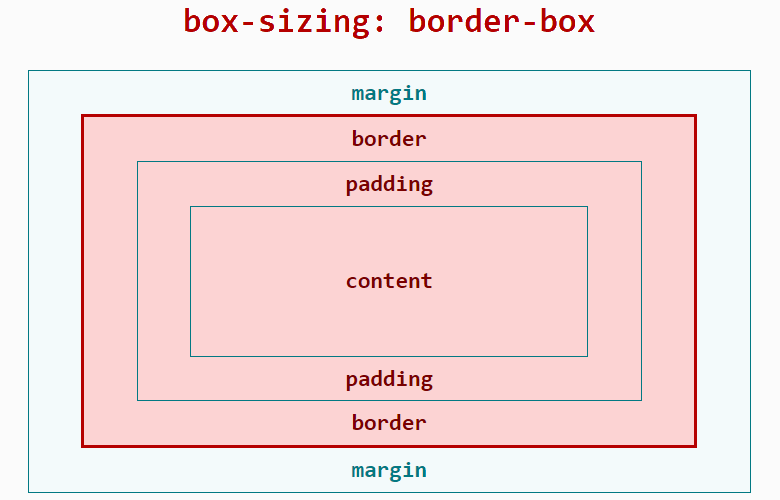

<!-- 源地址: https://iot.mi.com/vela/quickapp/zh/guide/framework/style/page-style-and-layout.html -->

# 页面样式与布局

## 盒模型

JS 应用布局框架使用 border-box 模型，具体表现与宽高边距计算可参考 MDN 文档[box-sizing (opens new window)](<https://developer.mozilla.org/zh-CN/docs/Web/CSS/box-sizing>)，暂不支持 content-box 模型与手动指定 box-sizing 属性。



布局所占宽度 Width：

`Width = width(包含padding-left + padding-right + border-left + border-right)`

布局所占高度 Height：

`Height = height(包含padding-top + padding-bottom + border-top + border-bottom)`

## 长度单位

框架对长度单位的支持，支持长度单位`px`、`%`、`dp`。

### px

与传统 web 页面不同，`px`是相对于`项目配置基准宽度`的单位，已经适配了移动端屏幕，其原理类似于`rem`。

开发者只需按照设计稿确定框架样式中的 px 值即可。

首先，我们需要定义`项目配置基准宽度`，它是项目的配置文件（`<ProjectName>/src/manifest.json`）中`config.designWidth`的值，默认不填则为 480。

然后， `设计稿1px`与`框架样式1px`转换公式如下：

```
设计稿1px / 设计稿基准宽度 = 框架样式1px / 项目配置基准宽度
```

**示例如下：**

若设计稿宽度为 640px，元素 A 在设计稿上的宽度为 100px，实现的两种方案如下：

**方案一：**

修改`项目配置基准宽度`：将`项目配置基准宽度`设置为`设计稿基准宽度`，则`框架样式1px`等于`设计稿1px`

  * 设置`项目配置基准宽度`，在项目的配置文件（`<ProjectName>/src/manifest.json`）中，修改`config.designWidth`：

```json
{
  "config": {
    "designWidth": 640
  }
}
```
  * 设置元素 A 对应的框架样式：

```
width: 100px;
```

**方案二：**

不修改`项目配置基准宽度`：若当前项目配置的`项目配置基准宽度`为 480，设元素 A 的框架样式 x`px`，由转换公式得：`100 / 640 = x / 480`。

  * 设置元素 A 对应的框架样式：

```
width: 75px;
```

### 百分比%

JS 应用的百分比计算规则与 css 类似，可参考[MDN 文档 (opens new window)](<https://developer.mozilla.org/zh-CN/docs/Web/CSS/percentage>)。

### dp3+

dp 单位，全称为 device independent pixels，即设备独立像素。

计算公式：dp 数值 = 物理分辨率 / 设备像素比(device pixel ratio)

举例：一个设备分辨率为 480*480，设备像素比 = 2，屏幕宽度 = 480 像素 = 240dp

示例代码：

```css
<style>
  .dp-box{
    width:360dp;
    height:360dp;
    background-color:green;
    margin-bottom:40px;
  }
</style>
```

## 设置定位

position 支持2种属性值：relative、absolute，并且默认值为 relative，可以参考[MDN 文档 (opens new window)](<https://developer.mozilla.org/zh-CN/docs/Web/CSS/position>)。

## 设置样式

开发者可以使用`内联样式`、`tag选择器`、`class选择器`、`id选择器`来为组件设置样式

同时也可以使用`并列选择`设置样式，暂时不支持`后代选择器`。

详细的文档可以查看[此处](</vela/quickapp/zh/guide/framework/style/>)。

**示例如下：**

```html
<template>
  <div class="page">
    <text style="color: #FF0000;">内联样式</text>
    <text id="title">ID选择器</text>
    <text class="title">class选择器</text>
    <text>tag选择器</text>
  </div>
</template>

<style>
  .page {
    flex-direction: column;
  }
  /* tag选择器 */
  text {
    color: #0000FF;
  }
  /* class选择器（推荐） */
  .title {
    color: #00FF00;
  }
  /* ID选择器 */
  #title {
    color: #00A000;
  }
  /* 并列选择 */
  .title, #title {
    font-weight: bold;
  }

</style>
```

## 通用样式

通用样式如 margin，padding 等属性可以点击[此处](</vela/quickapp/zh/components/general/style.html>)查询。

## Flex 布局示例

框架使用`Flex布局`，关于`Flex布局`可以参考外部文档[A Complete Guide to Flexbox (opens new window)](<https://css-tricks.com/snippets/css/a-guide-to-flexbox/>)。

`Flex布局`的支持也可以在官网文档的[通用样式](</vela/quickapp/zh/components/general/style.html>)查询。

div 组件为最常用的 Flex 容器组件，具有 Flex 布局的特性；text、span组件为文本容器组件，**其它组件不能直接放置文本内容** 。

**示例如下：**

```html
<template>
  <div class="page">
    <div class="item">
      <text>item1</text>
    </div>
    <div class="item">
      <text>item2</text>
    </div>
  </div>
</template>

<style>
  .page {
    /* 交叉轴居中 */
    align-items: center;
    /* 纵向排列 */
    flex-direction: column;
  }
  .item {
    /* 有剩余空间时，允许被拉伸 */
    /*flex-grow: 1;*/
    /* 空间不够用时，不允许被压缩 */
    flex-shrink: 0;
    /* 主轴居中 */
    justify-content: center;
    width: 200px;
    height: 100px;
    margin: 10px;
    background-color: #FF0000;
  }
</style>
```

## 动态修改样式

动态修改样式有多种方式，与传统前端开发习惯一致，包括但不限于以下：

  * **修改 class** ：更新组件的 class 属性中使用的变量的值
  * **修改内联 style** ：更新组件的 style 属性中的某个 CSS 的值
  * **修改绑定的对象** ：通过绑定的对象控制元素的样式 

**示例如下：**

```html
<template>
  <div style="flex-direction: column;">
    <!-- 修改 class -->
    <text class="normal-text {{ className }}" onclick="changeClassName">点击我修改文字颜色</text>
    <!-- 修改内联 style -->
    <text style="color: {{ textColor }}" onclick="changeInlineStyle">点击我修改文字颜色</text>
    <!-- 修改绑定的对象 -->
    <text style="{{ styleObj }}" onclick="changeStyleObj">点击我修改文字颜色</text>
  </div>
</template>

<style>
  .normal-text {
    font-weight: bold;
  }
  .text-blue {
    color: #0faeff;
  }
  .text-red {
    color: #f76160;
  }
</style>

<script>
  export default {
    private: {
      className: 'text-blue',
      textColor: '#0faeff',
      styleObj: {
        color: 'red'
      }
    },
    onInit () {
      console.info('动态修改样式')
    },
    changeClassName () {
      this.className = 'text-red'
    },
    changeInlineStyle () {
      this.textColor = '#f76160'
    },
    changeStyleObj () {
      this.styleObj = {
        color: 'yellow'
      }
    }
  }
</script>
```

## 引入 less/scss 预编译

### less 篇

less 语法入门请参考[less 中文官网 (opens new window)](<https://less.bootcss.com/>)。

使用 less 请先安装相应的类库：`less`、`less-loader`：

```
npm i less less-loader
```

详见文档[样式语法 --> 样式预编译](</vela/quickapp/zh/guide/framework/style/#样式预编译>)；然后在`<style>`标签上添加属性`lang="less"` **示例如下：**

```html
<template>
  <div class="page">
    <text id="title">less示例!</text>
  </div>
</template>
<style lang="less">
  /* 引入外部less文件 */
  @import './style.less';
  /* 使用less */
</style>
```

### scss 篇

scss 语法入门请参考[scss 中文官网 (opens new window)](<https://www.sasscss.com/>)。

使用 scss 请在JS 应用项目下执行以下命令安装相应的类库：`node-sass`、`sass-loader`：

```json
{
  "config": {
    "designWidth": 640
  }
}
```

详见文档[style 样式 --> 样式预编译](</vela/quickapp/zh/guide/framework/style/#样式预编译>)；然后在`<style>`标签上添加属性`lang="scss"`。 **示例如下：**

```json
{
  "config": {
    "designWidth": 640
  }
}
```

## 使用 postcss 解析 css

JS 应用支持 postcss 来解析 css，postcss 可以采用类似 less，sass 的语法来解析 css 了，比如支持变量，嵌套，定义函数等功能了。

使用 postcss 解析 css 分为 3 个步骤：

1.安装对应的 loader：

> npm i postcss-loader precss@3.1.2 -D

2.在项目的根目录新建一个 postcss.config.js，增加如下内容：

```json
{
  "config": {
    "designWidth": 640
  }
}
```

其中 precss 为 postcss 的插件。

3.在页面对应的 style 标签上增加 lang="postcss"，如下：

```json
{
  "config": {
    "designWidth": 640
  }
}
```

这样就可以在 css 里面书写对应的代码了。

说明

如果想支持更多的语法格式，可以在 postcss.config.js 文件里面添加更多的插件，关于 postcss 的插件见[插件地址 (opens new window)](<https://github.com/postcss/postcss/blob/master/docs/plugins.md>)。
