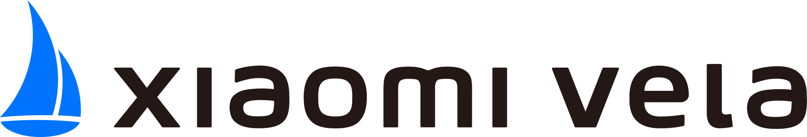

<!-- 源地址: https://iot.mi.com/vela/quickapp/zh/ -->

#  JS应用开发文档 

开发者友好，性能高效的IoT跨端应用框架 

[ 快速开始 ](</vela/quickapp/zh/guide/>)

## 开发者友好

类Web开发范式，快速上手，提供一站式开发工具，便捷高效。

## 丰富的组件和接口

提供了多种常用组件和接口，如网络、音频、图形和安全等，方便开发者快速构建应用。

## 性能高效

基于 Vela OS 进行应用开发，具有高实时性、低功耗、低延迟等特点，同时具备出色的渲染能力，媲美原生的流畅体验。

© Xiaomi Vela all rights reserved.
