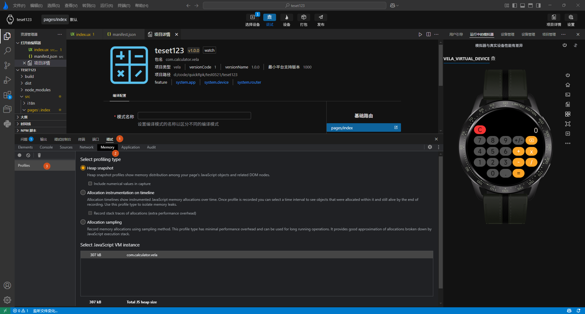

<!-- 源地址: https://iot.mi.com/vela/quickapp/zh/tools/debug/memory.html -->

# 内存分析

进行**内存泄漏** 排查时，您可以通过两次内存快照(dump)来协助分析。例如排查页面内存泄漏，先在进入页面前 dump 一次，再在推出页面后 dump 一次。排查内存泄漏有两种场景：

对于不依赖底层能力的应用：如果您的应用不需要诸如底层能力，您可以直接在 `AIoT-IDE` 中测试。在问题场景的前后分别点击 位置 4 来进行内存快照。

对于依赖底层能力的应用：您需要安装可以执行 js 堆内存快照的固件，运行命令 dump_js_heap /sdcard，然后将快照文件从真机设备拷贝到计算机上，在 `AIoT-IDE` 中通过 位置 3 加载进行分析。

在 `AIoT-IDE` 中，JavaScript 堆分析和导出的工具位于功能面板区域选择 **调试 - > Snapshot -> Profile**，如下图标签1，2，3所示：

