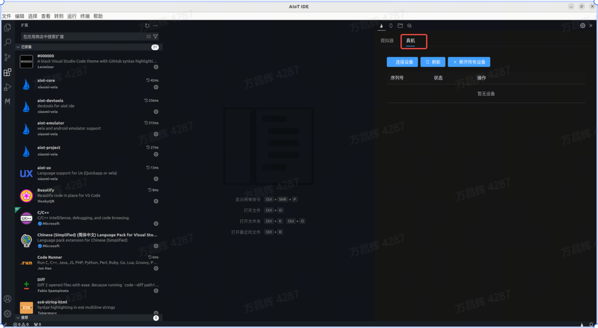
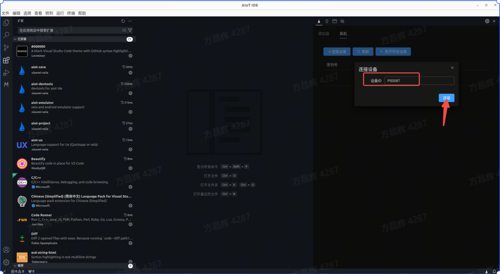
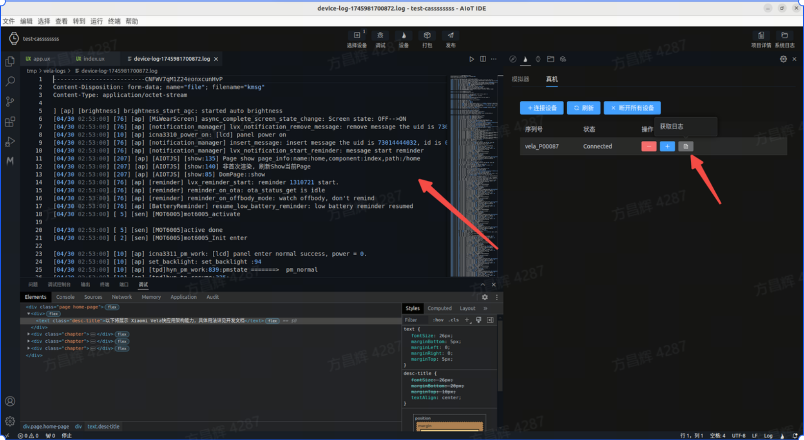

<!-- 源地址: https://iot.mi.com/vela/quickapp/zh/tools/devicedebug/start.html -->

# 功能介绍

支持开发**Xiaomi Vela JS** 应用时进行真机调试，在`AIoT-IDE`可通过设备ID连接真机，将应用推送到真机进行调试

## 设备升级

目前真机调试只支持 `Xiaomi Watch S4` 设备，请先联系小米工作人员获取`小米Vela设备真机调试全流程指南` 文档,按照文档内容，获取对应ota包将设备升级到支持真机调试的指定版本。注：升级固件存在一定风险，目前真机调试仅对特定合作方开放。

## 环境准备

  1. 请使用测试版小米运动健康，连接测试用机
  2. 请保证电脑网络和手机网络在一个局域网下

## 连接

1.打开rpk 先在真机上打开安装好的真机调试debug-app（图中红框标记的）

2.进行连接 打开debug-app后，点击开启调试，debug-app的中间按钮状态进入到【等待IDE连接】 

3.IDE端连接 在电脑端打开AIOT-IDE，进入真机调试界面 

4.开始连接 点击连接设备，输入设备IDE（设备ID从上面的debug-App中的设备ID获取），点击连接

5.连接成功 连接成功后，按钮下面列表中出现一条真机信息，状态显示为Connected

## 调试

在真机连接成功后，可进入调试阶段，将当前开发的vela应用在真机上调试。

1.选择设备 在顶部tab栏中点击连接设备，选择真机设备，然后点击调试，进入真机调试模式。

2.进入真机调试 调试运行成功后，真机上会自动打开当前应用，AIOT-IDE底部会直接打开调试面板

3 获取日志 在真机调试面板中点击获取日志，可直接拉取真机上的日志，获取的日志数量取决于该设备内核日志的缓冲区的大小。

4.推送其他rpk 在真机调试页面中可点击推送rpk按钮，选择要推送的非当前项目rpk进行推送，进行真机调试。

5.真机调试效果 在AIOT-IDE调试面板上进行调试，真机会实时显示调试效果(但不支持热更新，如要修改源码可点击打包按钮打包当前应用，通过第四步进行rpk安装)

 
